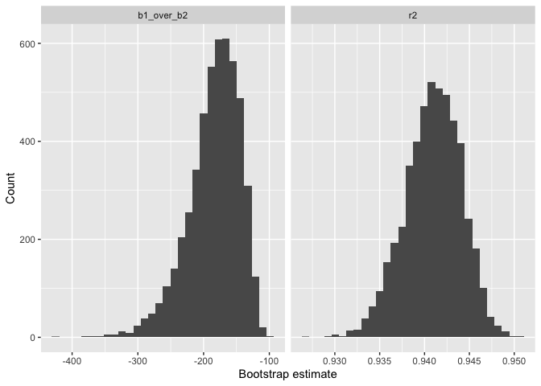
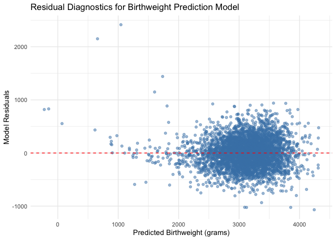

p8105_hw6_jr4550
================
Jeff Remo
2025-12-09

``` r
library(tidyverse)
```

    ## ── Attaching core tidyverse packages ──────────────────────── tidyverse 2.0.0 ──
    ## ✔ dplyr     1.1.4     ✔ readr     2.1.6
    ## ✔ forcats   1.0.1     ✔ stringr   1.6.0
    ## ✔ ggplot2   4.0.1     ✔ tibble    3.3.0
    ## ✔ lubridate 1.9.4     ✔ tidyr     1.3.1
    ## ✔ purrr     1.2.0     
    ## ── Conflicts ────────────────────────────────────────── tidyverse_conflicts() ──
    ## ✖ dplyr::filter() masks stats::filter()
    ## ✖ dplyr::lag()    masks stats::lag()
    ## ℹ Use the conflicted package (<http://conflicted.r-lib.org/>) to force all conflicts to become errors

``` r
library(p8105.datasets)
library(broom)

set.seed(1)
```

## Problem 2

``` r
data("weather_df")

boot_res =
  replicate(5000, {
    boot_dat = weather_df |> 
      sample_frac(replace = TRUE)
    
    fit = lm(tmax ~ tmin + prcp, data = boot_dat)
    
    r2 = glance(fit) |> 
      pull(r.squared)
    
    coefs = tidy(fit)
    
    b1 = coefs |> 
      filter(term == "tmin") |> 
      pull(estimate)
    
    b2 = coefs |> 
      filter(term == "prcp") |> 
      pull(estimate)
    
    ratio = b1 / b2
    
    c(r2 = r2, b1_over_b2 = ratio)
  })

boot_df = as_tibble(t(boot_res))

boot_df |> 
  pivot_longer(cols = everything(),
               names_to = "quantity",
               values_to = "value") |> 
  ggplot(aes(x = value)) +
  geom_histogram(bins = 30) +
  facet_wrap(~ quantity, scales = "free_x") +
  labs(x = "Bootstrap estimate", y = "Count")
```

<!-- -->

The distribution of the ratio of beta_1 to beta_2 is to be left-skewed
and unimodal with a majority of the data concentrated closer to the
right side of the plot.

The distribution of r2 appears to be relatively symmetric and unimodal
with a median bootstrap estimate hovering between 0.940 and 0.945.

``` r
boot_df |> 
  summarize(
    r2_low = quantile(r2, 0.025), 
    r2_high = quantile(r2, 0.975),
    ratio_low = quantile(b1_over_b2, 0.025),
    ratio_high = quantile(b1_over_b2, 0.975)
  ) |> 
  knitr::kable(digits = 2)
```

| r2_low | r2_high | ratio_low | ratio_high |
|-------:|--------:|----------:|-----------:|
|   0.93 |    0.95 |   -279.75 |    -125.69 |

Based on the table, the 95% CI for the ratio of beta_1 to beta_2 is
(-281.31, -124.80). The 95% CI for r2 is (0.93, 0.95).

## Problem 3

``` r
birthweight_data <- read_csv("data/birthweight.csv", na = c("NA", ".", "")) |> 
  janitor::clean_names() |> 
  mutate(
    babysex = as.factor(babysex),
    mrace = as.factor(mrace),
    frace = as.factor(frace),
    malform = as.factor(malform))
```

    ## Rows: 4342 Columns: 20
    ## ── Column specification ────────────────────────────────────────────────────────
    ## Delimiter: ","
    ## dbl (20): babysex, bhead, blength, bwt, delwt, fincome, frace, gaweeks, malf...
    ## 
    ## ℹ Use `spec()` to retrieve the full column specification for this data.
    ## ℹ Specify the column types or set `show_col_types = FALSE` to quiet this message.

``` r
adjusted_model <- lm(
  bwt ~ gaweeks + blength + bhead + ppbmi + wtgain + smoken + parity + babysex + mrace + fincome,
  data = birthweight_data)

birthweight_data |> 
  modelr::add_predictions(adjusted_model) |> 
  modelr::add_residuals(adjusted_model) |> 
  ggplot(aes(x = pred, y = resid)) +
  geom_point(alpha = 0.5, color = "steelblue") +
  geom_hline(yintercept = 0, linetype = "dashed", color = "red") +
  labs(
    x = "Predicted Birthweight (grams)", 
    y = "Model Residuals", 
    title = "Residual Diagnostics for Birthweight Prediction Model"
  ) +
  theme_minimal()
```

<!-- -->

The model includes birthweight (bwt) as the dependent variable, with
gestational age (gaweeks) and birth length (blength) as primary
predictors. Additional covariates were included to control for potential
confounding variables that may influence birthweight outcomes. These
adjustments help ensure that observed relationships reflect true
associations rather than spurious correlations.

### Comparison

``` r
cross_val_folds <- modelr::crossv_mc(birthweight_data, n = 50)

basic_model <- lm(bwt ~ blength + gaweeks, data = birthweight_data)

complex_model <- lm(bwt ~ bhead * blength * babysex, data = birthweight_data)

cv_results <- cross_val_folds |> 
  mutate(
    model_full = map(train, ~ lm(adjusted_model, data = as_tibble(.x))),
    model_basic = map(train, ~ lm(basic_model, data = as_tibble(.x))),
    model_complex = map(train, ~ lm(complex_model, data = as_tibble(.x))),
    
    rmse_full = map2_dbl(model_full, test, ~ {
      testing_data <- as_tibble(.y)
      predictions <- predict(.x, newdata = testing_data)
      actual_values <- testing_data |> pull(bwt)
      sqrt(mean((predictions - actual_values)^2))
    }),
    
    rmse_basic = map2_dbl(model_basic, test, ~ {
      testing_data <- as_tibble(.y)
      predictions <- predict(.x, newdata = testing_data)
      actual_values <- testing_data |> pull(bwt)
      sqrt(mean((predictions - actual_values)^2))
    }),
    
    rmse_complex = map2_dbl(model_complex, test, ~ {
      testing_data <- as_tibble(.y)
      predictions <- predict(.x, newdata = testing_data)
      actual_values <- testing_data |> pull(bwt)
      sqrt(mean((predictions - actual_values)^2))
    })
  ) |> 
  summarize(
    "Adjusted Model" = mean(rmse_full),
    "Basic Model" = mean(rmse_basic),
    "Interaction Model" = mean(rmse_complex)
  ) |> 
  pivot_longer(
    cols = everything(),
    names_to = "Model Specification",
    values_to = "Average RMSE"
  )
```

    ## Warning: There was 1 warning in `mutate()`.
    ## ℹ In argument: `rmse_full = map2_dbl(...)`.
    ## Caused by warning in `predict.lm()`:
    ## ! prediction from rank-deficient fit; attr(*, "non-estim") has doubtful cases

``` r
rmse_full <- cv_results |> 
  filter(`Model Specification` == "Adjusted Model") |> 
  pull(`Average RMSE`)

rmse_basic <- cv_results |> 
  filter(`Model Specification` == "Basic Model") |> 
  pull(`Average RMSE`)

rmse_complex <- cv_results |> 
  filter(`Model Specification` == "Interaction Model") |> 
  pull(`Average RMSE`)

improvement_basic_to_full <- ((rmse_basic - rmse_full) / rmse_basic) * 100
improvement_complex_to_full <- ((rmse_complex - rmse_full) / rmse_complex) * 100

cv_results |> knitr::kable(digits = 2)
```

| Model Specification | Average RMSE |
|:--------------------|-------------:|
| Adjusted Model      |       275.45 |
| Basic Model         |       331.70 |
| Interaction Model   |       289.93 |

Cross-validation results show clear performance differences across
models. The adjusted model achieved the best accuracy (RMSE = 275.45 g),
outperforming the basic model (RMSE = 331.7 g) by 17%. The interaction
model showed intermediate performance (RMSE = 289.93 g), improving 12.6%
over the basic model but remaining 14.48 grams less accurate than the
adjusted model. These results underscore the value of comprehensive
covariate adjustment in birthweight prediction.
